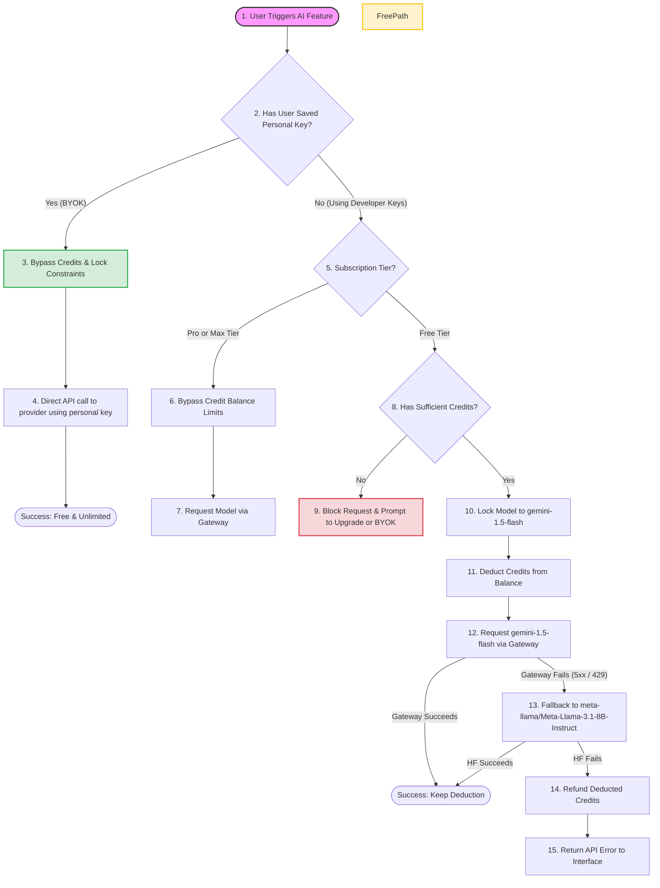

# ChatBridge Phased Billing & AI Credits Plan

This document presents a comprehensive, phased implementation plan to establish a credit-based billing system, lock model usage for non-paying users, and integrate custom API keys (BYOK) for unlimited access.

---

## 1. Credit Routing & Model Enforcement Flowchart

The diagram below details the decision-making logic inside the Chrome Extension and the Cloudflare Proxy Gateway for every incoming AI action:

---

## 2. AI Credit Costs & Tiers Mapping

| Action / Feature | Credit Cost | Model (Paid / BYOK) | Model (Free Proxy) | Execution Layer |
| :--- | :--- | :--- | :--- | :--- |
| **Tier 1 (Free / Local)** | | | | |
| Copy, Clean, Export | 0 credits | N/A | N/A | Local Content Script |
| Chat scanning | 0 credits | N/A | N/A | Local Content Script |
| Local search & embeddings | 0 credits | N/A | N/A | Local IndexedDB |
| Restore (using stored data) | 0 credits | N/A | N/A | Local Content Script |
| **Tier 2 (Cheap AI)** | | | | |
| Summarize | 1 credit | Preferred (e.g. Gemini 2.0 Flash) | `gemini-1.5-flash` | Cloud Proxy Gateway |
| Translate | 1 credit | Preferred (e.g. Gemini 2.0 Flash) | `gemini-1.5-flash` | Cloud Proxy Gateway |
| Rewrite | 1 credit | Preferred (e.g. Gemini 2.0 Flash) | `gemini-1.5-flash` | Cloud Proxy Gateway |
| Optimize / syncTone | 1 credit | Preferred (e.g. Gemini 2.0 Flash) | `gemini-1.5-flash` | Cloud Proxy Gateway |
| Generate titles | 1 credit | Preferred (e.g. Gemini 2.0 Flash) | `gemini-1.5-flash` | Cloud Proxy Gateway |
| **Tier 3 (Premium AI)** | | | | |
| Query / Chat | 3 credits | Preferred (e.g. Gemini 1.5 Pro) | `gemini-1.5-flash` | Cloud Proxy Gateway |
| Insights / Prompt | 3 credits | Preferred (e.g. Gemini 1.5 Pro) | `gemini-1.5-flash` | Cloud Proxy Gateway |
| Agent Routing (`agent_route`) | 5 credits | Hybrid / Auto-select | `gemini-1.5-flash` | Cloud Proxy Gateway |
| Multi-chat reasoning | 5 credits | Hybrid / Auto-select | `gemini-1.5-flash` | Cloud Proxy Gateway |

---

## 3. Phased Implementation Checklist

Use the checkbox list below to track progression through each phase:

### Phase 1: Background Logic & Credit Tracking
* [ ] **Credit Utility Implementation**: Add a central helper function `checkAndDeductCredits(action, provider)` to `background.js` to manage balance validation, deduction, and monthly calendar resets.
* [ ] **Refund Handler**: Implement a recovery mechanism to refund deducted credits if the gateway request ends in a hard error (such as a server timeout or invalid upstream response).
* [ ] **Model Selection Overrides**: Modify model selection helpers (`getNextAvailableModel` and `selectPhaseRouteMode`) to lock selected models to `gemini-1.5-flash` and `meta-llama/Meta-Llama-3.1-8B-Instruct` for free proxy requests.
* [ ] **Credit Integration in Message Receivers**: Add credit checks before invoking AI generation in:
  - `call_gemini`
  - `call_openai`
  - `call_llama`
  - `agent_route`
  - `translate_text`
  - `rewrite_text`
  - `chat_to_document`

### Phase 2: Gateway Security Checks
* [ ] **Worker Request Audit**: Modify the Cloudflare Worker Gateway (`workers/chatbridge-gateway/src/index.js`) to parse incoming headers and requests.
* [ ] **Default Token Restrictions**: If a request utilizes the default gateway token, check that the requested provider and model is strictly `gemini-1.5-flash` (or the `meta-llama/Meta-Llama-3.1-8B-Instruct` fallback).
* [ ] **Strict Reject Handler**: Return an `HTTP 403 Forbidden` response from the Gateway if a free-proxy client attempts to bypass the extension constraints and query higher models (e.g., `gemini-1.5-pro` or `gemini-2.0-flash`).

### Phase 3: APIs & Billing Options UI
* [ ] **Sidebar Nav Addition**: Insert a new Navigation item (`data-section="api-keys"`) into `options.html` referencing the i18n label `apiKeys`.
* [ ] **Section UI Panel**: Create `<section class="section" id="section-api-keys">` inside `options.html` containing:
  - **Subscription Plan Status**: Displays "Free Tier" or "Pro Plan" with upgrade CTA.
  - **Credit Progress Tracker**: Shows visual progress bar of remaining credits out of 100, and reset info.
  - **BYOK Key Inputs Grid**: Form fields for Gemini, OpenAI, HuggingFace, and Nvidia keys with Show/Hide toggles, Save, and Delete buttons.
  - **"Test Connection" Button**: Triggers a connection test message to verify the key is valid.
  - **Developer Sandbox Controls**: Buttons to manually manipulate credit count and tiers during local testing.
* [ ] **Options Script Hooks**: Update `options.js` to handle saving/deleting local keys and running connection tests.
* [ ] **Checkout Integration**: Bind `welcome.js` plan selection to local storage state `chatbridge_subscription_tier`.

### Phase 4: Verification & Testing
* [ ] **Write Unit Tests**: Create `tests/unit/credits.test.js` to test credit deductions, reset timers, and BYOK overrides.
* [ ] **Manual Sanity Runs**: Verify credit limit block screens and verify the BYOK bypass flow using invalid and valid key test runs.

---

## 4. Storage Key Contracts

To ensure extension worker wakes and sleep cycles preserve credit data correctly, we will use the following keys in `chrome.storage.local`:

| Storage Key | Data Type | Default Value | Description |
| :--- | :--- | :--- | :--- |
| `chatbridge_subscription_tier` | String | `'free'` | User subscription level (`'free'`, `'pro'`, `'max'`). |
| `chatbridge_credits_balance` | Number | `100` | Current remaining credit balance. |
| `chatbridge_credits_last_reset` | Number (Epoch) | Current Time | Timestamp of the last monthly credit allocation reset. |
| `chatbridge_gemini_key` | String | `''` | Custom user-supplied Gemini API key. |
| `chatbridge_openai_key` | String | `''` | Custom user-supplied OpenAI API key. |
| `chatbridge_hf_key` | String | `''` | Custom user-supplied HuggingFace API key. |
| `chatbridge_api_nvidia` | String (Encrypted) | `''` | Custom user-supplied Nvidia API key, encrypted via GCM. |
